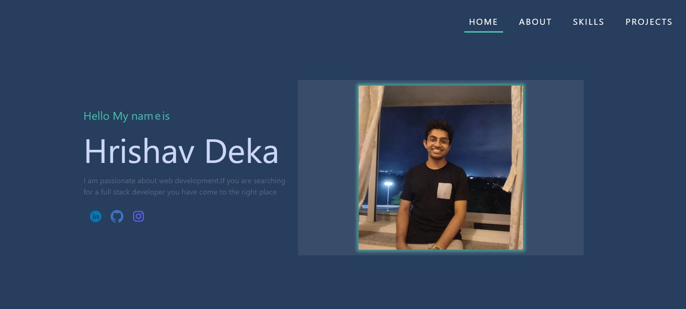

# Hrishav's Portfolio

## Overview

Welcome to my portfolio!

## Features

- **Responsive Design:** Accessible on various devices.
- **Portfolio Section:** Showcase of my work.
- **About Me:** Brief bio.
- **Skills:** List of few of my skills
- **Contact Form:** Can be used to send me a email from the website itself.

## Dependencies

- **@chakra-ui/react:** ^2.8.0
- **@emailjs/browser:** ^3.11.0
- **animate.css:** ^4.1.1
- **aos:** ^2.3.4
- **framer-motion:** ^10.15.0
- **lottie-react:** ^2.4.0
- **react:** ^18.2.0
- **react-router-dom:** ^6.14.2
- **web-vitals:** ^2.1.4

## Getting Started
To get a local copy of this project up and running on your machine, follow these steps:

## Installation
```bash
git clone https://github.com/hrishav77/Portfolio.git
cd portfolio
npm install
npm start
```
## Screenshots



